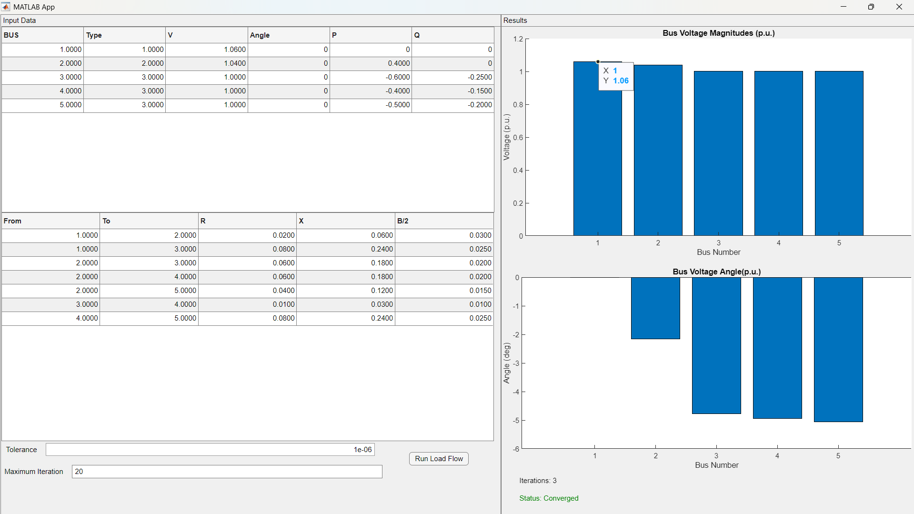

# Newton–Raphson Load Flow Analysis (MATLAB)

## Overview

This project implements the Newton–Raphson (NR) load flow algorithm for a 5-bus power system using MATLAB.  

The solver is developed from first principles, without relying on built-in power system toolboxes, and follows a modular, function-based design.

The implementation computes steady-state bus voltage magnitudes and phase angles by solving the nonlinear power flow equations using analytical Jacobian formulation.

---

## Application Dashboard

The MATLAB App Designer interface allows interactive execution of the Newton–Raphson load flow analysis and visualization of results.

## Key Features

\- Y-bus matrix formation 

\- Proper handling of Slack, PV, and PQ buses 

\- Analytical formulation of the Jacobian matrix (J₁–J₄)  

\- Newton–Raphson iterative solution with quadratic convergence  

\- Clean, modular MATLAB code suitable for extension and GUI integration  

---

## System Details

\- Number of buses: 5

\- Base MVA: 100

\- Load flow method: Newton–Raphson

\- Convergence tolerance: 1 × 10⁻⁶

\- Convergence achieved in 3 iterations(With Current Bus and Line Data)

---

## Project Structure

NR\_5Bus\_LoadFlow/

│

├── data/

│ ├── busdata.m 

│ └── linedata.m

│

├── core/

│ ├── ybus.m 

│ ├── powercalc.m 

│ ├── mismatch.m 

│ ├── jacobian.m 

│ └── NR\_loadflow.m 

│

├── assets

│ └──Dashboard.png

│

├── main.m % Entry point

│

├── app/

│ └── LoadFlowApp.mlapp

└── README.md

## How to Run 

Script Version

1\. Open MATLAB  

2\. Set the current folder to the project directory  

3\. Run:

&nbsp;  	main.m

App Version

1\. Open MATLAB.

2\. Navigate to the app folder.

3\. Open:

&nbsp;	LoadFlowApp.mlapp

4\. Click Run and execute the load flow from the app interface.

